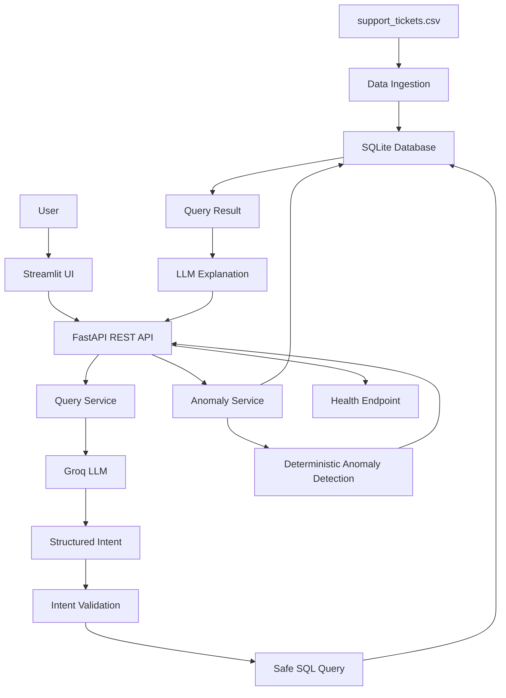

# AI Support Intelligence

An AI-powered customer support intelligence system built for the **DOTMappers IT Pvt. Ltd. AI Engineer Technical Assessment**.

The system ingests support tickets from a CSV file, stores them in SQLite, understands natural-language questions using an LLM, executes safe database queries, detects anomalies, and exposes the functionality through a FastAPI REST API and Streamlit web interface.

---

## Features

* CSV data ingestion using Pandas
* SQLite database for ticket storage
* Natural-language querying using Groq LLM
* Structured intent generation
* Safe query validation
* Parameterized SQL queries
* Support-ticket anomaly detection
* FastAPI REST API
* Streamlit web interface
* API health monitoring
* Pytest test suite
* No paid database or infrastructure required

---

## System Architecture



### Query Flow

```text
User Question
      |
      v
Streamlit UI
      |
      | HTTP POST /query
      v
FastAPI
      |
      v
Groq LLM
      |
      v
Structured Intent
      |
      v
Intent Validation
      |
      v
Application-generated SQL
      |
      v
SQLite Database
      |
      v
Query Result
      |
      v
LLM Explanation
      |
      v
FastAPI Response
      |
      v
Streamlit UI
```

### Anomaly Flow

```text
SQLite Database
      |
      v
Anomaly Service
      |
      v
Rule-based Checks
      |
      +---- Critical unresolved tickets
      |
      +---- High unresolved tickets
      |
      +---- Long unresolved tickets
      |
      +---- Resolution-time outliers
      |
      +---- Response-time outliers
      |
      v
Anomaly Results
      |
      v
FastAPI /anomalies
      |
      v
Streamlit UI
```

---

# Project Structure

```text
ai-support-intelligence/
|
+-- app/
|   +-- __init__.py
|   +-- main.py
|   |
|   +-- api/
|   |   +-- __init__.py
|   |   +-- routes_query.py
|   |   +-- routes_anomaly.py
|   |   +-- routes_health.py
|   |
|   +-- core/
|   |   +-- __init__.py
|   |   +-- config.py
|   |   +-- database.py
|   |
|   +-- services/
|   |   +-- __init__.py
|   |   +-- llm_service.py
|   |   +-- query_service.py
|   |   +-- anomaly_service.py
|   |   +-- ingestion.py
|   |
|   +-- models/
|   |   +-- __init__.py
|   |   +-- schemas.py
|   |
|   +-- utils/
|       +-- __init__.py
|       +-- sql_validator.py
|
+-- data/
|   +-- support_tickets.csv
|
+-- database/
|   +-- support_tickets.db
|
+-- ui/
|   +-- streamlit_app.py
|
+-- tests/
|   +-- test_api.py
|   +-- test_anomaly.py
|   +-- test_query.py
|
+-- .env.example
+-- .gitignore
+-- requirements.txt
+-- README.md
```

---

# Technology Stack

| Component            | Technology           |
| -------------------- | -------------------- |
| Language             | Python               |
| API                  | FastAPI              |
| API Server           | Uvicorn              |
| UI                   | Streamlit            |
| Database             | SQLite               |
| Data Processing      | Pandas               |
| Numerical Processing | NumPy                |
| Database Layer       | SQLAlchemy           |
| LLM                  | Groq                 |
| LLM Model            | `openai/gpt-oss-20b` |
| Testing              | Pytest               |

---

# Dataset

The application uses the provided:

```text
data/support_tickets.csv
```

The assessment dataset contains **500 support tickets**.

## Dataset Columns

| Column                | Description                    |
| --------------------- | ------------------------------ |
| `ticket_id`           | Unique ticket identifier       |
| `created_at`          | Ticket creation timestamp      |
| `category`            | Billing, Technical, or General |
| `priority`            | Low, Medium, High, or Critical |
| `status`              | Open, Resolved, or Escalated   |
| `response_time_hrs`   | Time taken to respond          |
| `resolution_time_hrs` | Time taken to resolve          |
| `agent_id`            | Support agent identifier       |
| `customer_rating`     | Customer rating                |
| `issue_summary`       | Short description of the issue |

For unresolved tickets, `resolution_time_hrs` and `customer_rating` may be unavailable.

---

# How the AI Query System Works

The system does not allow the LLM to directly execute SQL.

Instead, the LLM converts the user's question into a structured intent.

For example:

```text
How many tickets are currently open?
```

The LLM produces an intent similar to:

```json
{
  "intent": "count",
  "filters": [
    {
      "column": "status",
      "operator": "=",
      "value": "Open"
    }
  ],
  "aggregation": null,
  "group_by": null,
  "order": "desc",
  "limit": 100,
  "time_period": null
}
```

The application then:

1. Validates the intent.
2. Checks allowed columns.
3. Checks allowed operators.
4. Checks allowed aggregations.
5. Builds the SQL query.
6. Uses parameterized values.
7. Executes the query against SQLite.
8. Sends the result to the LLM for a concise explanation.

This approach gives the system more control than allowing the LLM to generate arbitrary SQL.

---

# REST API

The project provides a REST API using FastAPI.

## Available Endpoints

| Method | Endpoint                       | Purpose                                       |
| ------ | ------------------------------ | --------------------------------------------- |
| GET    | `/health`                      | Check API health                              |
| POST   | `/query`                       | Ask a natural-language question               |
| GET    | `/anomalies`                   | Detect anomalies                              |
| GET    | `/anomalies?period=this_week`  | Detect anomalies for the latest dataset week  |
| GET    | `/anomalies?period=this_month` | Detect anomalies for the latest dataset month |

---

# Health API

## Request

```http
GET /health
```

Example:

```text
http://127.0.0.1:8000/health
```

Example response:

```json
{
  "status": "healthy",
  "service": "AI Support Intelligence"
}
```

---

# Query API

## Request

```http
POST /query
```

Example JSON:

```json
{
  "question": "How many tickets are currently open?"
}
```

Example response structure:

```json
{
  "question": "How many tickets are currently open?",
  "answer": "There are currently 123 open tickets.",
  "result": [
    {
      "count": 123
    }
  ],
  "intent": {
    "intent": "count"
  }
}
```

The exact values depend on the dataset.

---

# Anomaly API

## All Tickets

```http
GET /anomalies
```

## This Week

```http
GET /anomalies?period=this_week
```

## This Month

```http
GET /anomalies?period=this_month
```

The response contains information such as:

* Ticket ID
* Priority
* Status
* Category
* Agent
* Response time
* Resolution time
* Anomaly type
* Reason

---

# Interactive API Documentation

FastAPI automatically provides Swagger documentation.

After starting the API, open:

```text
http://127.0.0.1:8000/docs
```

This allows the evaluator to test all REST endpoints directly from the browser.

---

# Anomaly Detection

Anomaly detection is implemented using deterministic Python logic instead of relying on the LLM.

This makes anomaly results:

* Reproducible
* Explainable
* Testable
* Independent of LLM randomness

## Rule-Based Detection

The system checks for situations such as:

```text
Critical priority + unresolved + beyond threshold
```

```text
High priority + unresolved + beyond threshold
```

```text
Unresolved + extended waiting time
```

## Statistical Detection

Response and resolution times can also be checked for statistical outliers using the Interquartile Range method.

```text
IQR = Q3 - Q1

Upper Bound = Q3 + 1.5 x IQR

Lower Bound = Q1 - 1.5 x IQR
```

Values outside the calculated range can be flagged as statistical outliers.

---

# Streamlit User Interface

The project includes a minimal Streamlit UI.

The UI contains two main sections:

## Ask Questions

Users can enter questions in natural language.

Examples:

```text
How many tickets are currently open?
```

```text
Which agent resolved the most tickets this month?
```

```text
What is the average customer rating for Technical category tickets?
```

```text
How many Critical tickets are unresolved?
```

---

## Anomalies

Users can select:

```text
All tickets
This week
This month
```

The interface displays:

* Total anomalies
* Critical anomalies
* High anomalies
* Medium anomalies
* Individual anomaly details

---

# Example Questions

The following are examples of questions supported by the system.

### Ticket Count

```text
How many tickets are currently open?
```

### Agent Performance

```text
Which agent resolved the most tickets this month?
```

### Critical Tickets

```text
Show me all Critical tickets not resolved within 12 hours.
```

### Customer Rating

```text
What is the average customer rating for Technical category tickets?
```

### Anomaly Detection

```text
Are there any anomalies in resolution times this week?
```

Other examples:

```text
How many tickets are in the Billing category?
```

```text
How many High priority tickets are there?
```

```text
What is the average response time?
```

```text
What is the average resolution time for Technical tickets?
```

```text
Show me unresolved Critical tickets.
```

---

# Installation

## Requirements

Install the following:

* Python 3.10 or newer
* Git
* Groq API key

The project does not require:

* PostgreSQL
* Docker
* Paid cloud infrastructure
* Paid AI APIs

---

# 1. Clone the Repository

```powershell
git clone https://github.com/123Aimu321/ai-support-intelligence.git
```

Move into the project directory:

```powershell
cd ai-support-intelligence
```

---

# 2. Create Virtual Environment

On Windows PowerShell:

```powershell
py -3.13 -m venv .venv
```

Activate it:

```powershell
.\.venv\Scripts\Activate.ps1
```

If PowerShell blocks activation:

```powershell
Set-ExecutionPolicy -ExecutionPolicy RemoteSigned -Scope CurrentUser
```

Then activate again:

```powershell
.\.venv\Scripts\Activate.ps1
```

---

# 3. Install Dependencies

```powershell
pip install -r requirements.txt
```

---

# 4. Configure Groq

Create a file named:

```text
.env
```

Add:

```env
GROQ_API_KEY=your_actual_groq_api_key
GROQ_MODEL=openai/gpt-oss-20b
```

The repository includes `.env.example` as a template.

Do not upload your actual `.env` file or API key to GitHub.

---

# 5. Initialize the Database

The database is automatically initialized when FastAPI starts.

It can also be initialized manually:

```powershell
python -c "from app.services.ingestion import initialize_database; print('Loaded tickets:', initialize_database())"
```

Expected output:

```text
Loaded tickets: 500
```

This creates:

```text
database/support_tickets.db
```

---

# Running the Application

## Start FastAPI

From the project root:

```powershell
uvicorn app.main:app --reload
```

The API will run at:

```text
http://127.0.0.1:8000
```

Swagger documentation:

```text
http://127.0.0.1:8000/docs
```

---

# Start Streamlit

Open a second PowerShell terminal.

Navigate to the project:

```powershell
cd ai-support-intelligence
```

Activate the environment:

```powershell
.\.venv\Scripts\Activate.ps1
```

Run:

```powershell
streamlit run ui/streamlit_app.py
```

The UI will normally be available at:

```text
http://localhost:8501
```

---

# Complete Startup Process

```text
Clone Repository
      |
      v
Create Virtual Environment
      |
      v
Install Requirements
      |
      v
Create .env
      |
      v
Add Groq API Key
      |
      v
Start FastAPI
      |
      v
Start Streamlit
      |
      v
Open Browser
      |
      +----------------------+
      |                      |
      v                      v
Ask Questions          Check Anomalies
```

---

# Testing

Tests are located in:

```text
tests/
```

Run all tests using:

```powershell
pytest
```

The test suite covers important functionality including:

* API behavior
* Query processing
* Anomaly detection
* Query validation

---

# Security and Query Safety

The project uses several controls to prevent unsafe database operations.

## Allowed Columns

Only known dataset columns can be queried.

## Allowed Operations

Supported operations include:

```text
count
average
sum
minimum
maximum
group_count
group_average
list
```

## Parameterized SQL

Values are passed to SQLite using parameters instead of unsafe string concatenation.

## Result Limits

Query results are limited to prevent unnecessarily large responses.

## No Arbitrary SQL

The LLM does not directly execute SQL.

The application converts the validated structured intent into SQL.

---

# Time Period Handling

The query system supports:

```text
this_week
this_month
```

The dataset is historical rather than a live production data stream.

Therefore, relative time periods are calculated using the latest available timestamp in the dataset as the reference point.

This makes evaluation behavior deterministic.

---

# Design Decisions

## Why SQLite?

SQLite was selected because:

* It requires no separate database server.
* It is free.
* It is easy to configure.
* It works well for a 500-row assessment dataset.
* Evaluators can run the project locally with minimal setup.

For a production system with many concurrent users, PostgreSQL would be a better option.

---

## Why FastAPI?

FastAPI provides:

* REST API support
* Request validation
* Type-safe schemas
* Automatic Swagger documentation
* Simple Python integration
* Good performance

---

## Why Streamlit?

Streamlit was selected because the assessment requires a minimal UI.

It allows a functional interface to be created without adding unnecessary frontend complexity.

The UI communicates with FastAPI rather than directly accessing the database.

---

## Why Groq?

Groq provides fast LLM inference and can be used through its available free-tier access.

The application keeps the LLM integration isolated inside the LLM service so that another provider or a local model can be substituted later.

---

## Why Structured Intent Instead of LLM-Generated SQL?

The LLM generates a structured representation of the user's request rather than unrestricted SQL.

This gives the application greater control over:

* Columns
* Filters
* Operators
* Aggregations
* Grouping
* Sorting
* Limits

---

# Future Improvements

Possible production improvements include:

* PostgreSQL
* User authentication
* Role-based access control
* Background data ingestion
* Scheduled anomaly detection
* Email or Slack alerts
* Agent performance dashboards
* Configurable SLA thresholds
* Query history
* Conversation memory
* Local LLM support using Ollama
* Docker deployment
* CI/CD with GitHub Actions
* Production monitoring
* Logging and observability
* Caching

---

# Assessment Requirement Coverage

| Assessment Requirement     | Implementation               |
| -------------------------- | ---------------------------- |
| CSV ingestion              | Pandas + SQLite              |
| Queryable data             | SQLite                       |
| Natural-language questions | Groq LLM                     |
| LLM integration            | Structured intent generation |
| Query validation           | Intent/SQL validator         |
| Anomaly detection          | Deterministic Python engine  |
| REST API                   | FastAPI                      |
| `/query`                   | Implemented                  |
| `/anomalies`               | Implemented                  |
| `/health`                  | Implemented                  |
| Minimal UI                 | Streamlit                    |
| Testing                    | Pytest                       |
| Documentation              | README                       |
| Python                     | Yes                          |
| Paid database              | Not required                 |

---

# Architecture Summary

```text
                    +------------------+
                    |   Streamlit UI   |
                    +--------+---------+
                             |
                             | HTTP
                             v
                    +------------------+
                    |   FastAPI REST    |
                    |       API         |
                    +--------+---------+
                             |
             +---------------+---------------+
             |                               |
             v                               v
      +-------------+                +---------------+
      | Query       |                | Anomaly       |
      | Service     |                | Service       |
      +------+------+                +-------+-------+
             |                               |
             v                               v
      +-------------+                +---------------+
      | Groq LLM    |                | Python Rules  |
      +------+------+                +-------+-------+
             |                               |
             v                               |
      +-------------+                         |
      | Structured  |                         |
      | Intent      |                         |
      +------+------+                         |
             |                               |
             v                               |
      +-------------+                         |
      | Validation  |                         |
      +------+------+                         |
             |                               |
             +---------------+---------------+
                             |
                             v
                    +------------------+
                    | SQLite Database  |
                    +------------------+
                             ^
                             |
                    +------------------+
                    | CSV Ingestion    |
                    +------------------+
                             ^
                             |
                    support_tickets.csv
```

---

# Walkthrough Talking Points

During the technical walkthrough, the project can be explained in the following order:

## 1. Problem

The goal is to make customer support ticket data easier to query and monitor.

## 2. Data Ingestion

The CSV is validated and loaded into SQLite.

## 3. Natural Language

The user asks a question in normal English.

## 4. LLM

Groq interprets the question and produces a structured intent.

## 5. Validation

The application validates the generated intent.

## 6. Database Query

Python builds a safe, parameterized SQL query.

## 7. Result Explanation

The query result is converted into a concise natural-language response.

## 8. Anomaly Detection

Anomaly detection is handled using deterministic Python rules and statistical methods.

## 9. REST API

FastAPI exposes `/query`, `/anomalies`, and `/health`.

## 10. UI

Streamlit provides a simple interface for interacting with the API.

---

# Important Security Note

Never commit your actual Groq API key.

The following file should **not** be uploaded:

```text
.env
```

The repository should contain:

```text
.env.example
```

Example:

```env
GROQ_API_KEY=your_groq_api_key_here
GROQ_MODEL=openai/gpt-oss-20b
```

---

# Author

**Aiman Parker**

AI/ML Engineer

Skills demonstrated in this project include:

* Python
* FastAPI
* REST APIs
* SQL
* SQLite
* Pandas
* Machine Learning concepts
* LLM integration
* Natural-language processing
* Anomaly detection
* Streamlit

---

# Assessment

This project was developed as part of the:

**End-to-End AI System Sprint — AI Engineer Technical Assessment**

**DOTMappers IT Pvt. Ltd.**

The implementation demonstrates an end-to-end AI application combining data ingestion, database querying, LLM-based natural-language understanding, deterministic anomaly detection, REST APIs, and a web interface.
